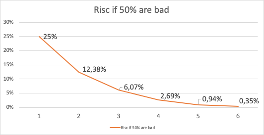
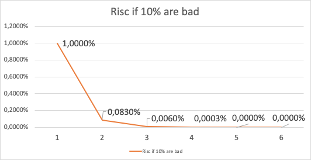

# Threat Model for Incubed

## Registry Issues

### Long-Term Attack
Status: open

A client is offline for a long time and has not updated the nodelist. During this time a Server has now been convicted and/or removed from the list. The client may now send a request to this server, which means that it cannot be convicted anymore and the client has no way to know that.

Solutions:

> CHR: Yes. I think often the fallback is “out of service”. What will happen is that those random nodes (A,C) will not respond.
> We (slock.it) could help them update the list centrally.

> But I think the best way is the following:
> Allow nodes to commit to stay in the registry for a fixed amount of time. During this time they cannot withdraw their funds.
> Clients will most likely look first for those nodes, especially the clients who only occasionally need data from the chain.
 
> SIM: Yes this might help, but only protects against regular unregistering. If you convict a server, this timeout does not help.

> In order to remove this issue completely, you need a trusted authority where you can update the nodeList first. 
> But for the 100% decentralized way, you can only reduce it by asking multiple servers. Since they also pass the latest blocknumber when the nodeList has changed, the client will find out, that he needs to update the nodeList and by having multiple requests in parallel he reduces the risk of relying on a manipulated nodeList. Because the malicious server may return a correct nodeList for an older block when this server was still valid, and even get signatures for this, but not for a newer BlockNumber, which can only be found out by asking as many servers as needed.

> Another point is that as long as the signature does not come from the same server, the Data-Provider is always check. So even if you request a signature from a server that is not part of the list anymore, the DataProvider rejects it. In order to use this attack, both (The DataProvider and BlockHashSigner) must work together in order to provide a proof that matches the wrong blockhash.

> CHR: Correct. I think the strategy for clients who have been offline for a while is to first get multiple signed blockhashes from different source (ideally from bootstrap nodes similar to light clients and ask for the current list). Actually, we could define the same bootstrap nodes as are currently hard-coded in parity and geth

### Inactive Server Spam Attack
Status: open

Everyone can register a lot of servers that don’t even exist or are not running. They may even put in a decent deposit. Of course, the client would try and find out that these nodes are inactive, but all you can do is call ‘requestUnregisterServer’ which gives the server 28 days to cancel it. This also includes a small deposit you need to store, which you will lose, if the attacker simply checks for these events and calls ‘cancelUnregisterServer’. This means he may even make money since he will get the deposit that the user needed to store in order to convict him. And if this is an active attacker, the chances of losing this are very high.

Now since each client will eventually detect these servers and locally blacklist them, Incubed will still work, but for each new node this means the first request may take a while until all the inactive servers are marked and blacklisted and he finds an active one.

Solutions:

> SIM: The only Solution I see here would be a reputation system. There you could downvote inactive servers and leave it up to the client to exclude servers with a low reputation, but of course this opens up a new issue: How can you avoid active servers being downvoted by a malicious server in order to bring down the network? And since this transaction costs gas, why should anybody be incentivized to downvote real inactive servers?

> CHR: I think the only protection against this is a mimimal deposit for each server. This doesn’t solve it completely, but it mitigates the issue. There is nothing to gain for inactive servers. If it happens, the length of the list is very large. The client would sort for those with the highest deposit


### Self Convict Attack

Status: solved

A user may register a malicious server and even store a deposit. He then signs a wrong blockhash and uses a 2nd account to convict himself in order to get the deposit before somebody else can.

Solutions:

> SIM: In this case the attacker would lose 50% of his deposit, because this will be burned. But this also means he would get the other half, and so the price he would have to pay for lying is up to 50% of his deposit. This should be considered by the clients when picking nodes for signatures.


## Network-Attacks

### Blacklist Attack

Status: open

If the client has no direct Internet connection and must rely on a proxy or the phone to do the requests, this would give the intermedier the chance to set up a malicious server.
This is done by simply forwarding the request to its own server instead of the requested one. Of course he may prepare a wrong answer, but he cannot forge the signatures of the blockhash. But instead of sending back any signed hashes, he may return no signatures, which indicates to the client that those were not willing to sign them. Then the client will blacklist them and request the signature from other nodes. The Proxy or Relay could return no signature and repeat that until all are blacklisted and the client finally asks for the signature from a malicious node which would then give the signature and the response. Since both come from a bad acting server, he will not convict himself and so prepare a proof for a wrong response.

Solutions:

> First we may consider signing the response of the Data provider-Node, even if this signature cannot be used to convict, but then the client knows that this response came from the client he requested and was also checked by him. This would reduce the chances of this attack, since this would mean that the client picked 2 random servers, both acting malicious together.
> If the client blacklisted more than 50% of the nodes, he should stop. The only issue here is that the client does not know whether this is an ‘Inactive Server Spam Attack’ or not. In case of the 'Inactive Server Spam Attack’ it would actually be good to blacklist 90% of the servers and still be able to work with the remaining 10%. But if the proxy is the problem, then the client needs to stop blacklisting. 

> CHR: I think the client needs a list of nodes (bootstrape nodes) which needs to sign in the case the response is no signature at all. No signature at all should default to untrusted relayer. In this case it needs to go to trusted relayers. Or ask the untrusted relayer to get a signature from one of the trusted relayers. If he forwards the signed reponse, he should become trusted again.


### DDOS-Attacks
Since the URLS of the Network are known, they may be targets for DDOS-Attacks.

Solution:
> Each node is reponsible for protecting with services like Cloudflare. Also, the nodes should have an upper limit of concurrent requests it can handle. The response with status 500 should indicate reaching this limit. This will still lead to blacklisting, but this protects the node by not sending more requests.

> CHR: The same is true for bootstrapping nodes of the foundation.
 
### None Verifying Data Provider

A Data Provider should always check the signatures of blockhash he received from the signers and of course he incentivised to do so, because then he can get their deposit, but after getting the deposit he is not incentivised to report this to the client. There are 2 scenarios:

1. The Data Provider gets the signature, but doesn't check it. 
    In this case at least the verification inside the client will fail since the provided blockheader does not match.
2. The Data Provider works together with signer. 
    In this case he would prepare a wrong blockheader that fits to the wrong blockhash and would pass the verification inside the client.  

Solutions:

> SIM: In this case only a higher number of signatures could increase security.

## Privacy

### Private Keys as API-Keys

For the scoring-model we are using private keys. The perfect security-model would be registering each client, which is almost impossible on mainnet, if you have a lot of devices. So using shared keys is very likely to happen, but this is a nightmare for security experts. 

Solution:
1. limit the power of such a key, so the worst thing that can happen, is a leaked key which could be used by other clients which will then be able to use the score of the server the key is assigned to.
2. keep the private key secret and  manage the connection to the server only offchain. 

### Filtering of Nodes

All nodes are known with its URL in the ServerRegistry-contract. For countries trying to filter blockchain-requests this makes it easy to add these URLs on blacklists of firewalls, which would stop the Incubed network.

Solution:

> Support Onion-URLs, dynamic IPs, LORA, BLE or other protocols. 
 

### Inspecting Data in Relays or Proxies

For devices like BLE a relay like a phone is used to connect to the Internet. Since relay is able to read the content, it is possible to read the data or even pretend the server is not responding. (See Blacklist-Attack)
 

Solution:

> Encrypt the data by using the public key of the server. This can only be decrypted by the target-server with the private key.


## Risc Calculation

Just like with the light client, there is no 100% security to protect from malicious servers. The only way to reach this would be to trust special authority nodes for signing the blockhash. For all other nodes we must always assume they are trying to find ways to cheat.
The risk of losing the deposit is significantly lower if the DataProvider Node and the Signing Nodes are run by the same attacker. In this case he will not only skip checks, but also prepare the data and the proof and also a blockhash that matches the blockheader. If this is the only request and  the client has no other anchor, he accepts a malicious response.

Depending on how many malicious nodes have registered themselves and are working together, the risk can be calculated. If 10% of all registered nodes are run by an attacker (with the same deposit as the rest), the risk of getting a malicious response is 1% with only 1 signature, and it goes down to 0,006% with 3 signatures:

In case of an attacker controlling 50% of all nodes, it looks a bit different. Here one signature gives you a risk of 25% to get a bad response and it takes more than 4 signatures to reduce this to under 1%.

Solution:

> The risk can be reduced by sending 2 requests in parallel. This way the attacker cannot be sure that his attack is successful because chances are higher to detect this. If both requests lead to a different result, this conflict can be forwarded to as many servers as possible, where these server then can check the blockhash and may convict the malicious server.

