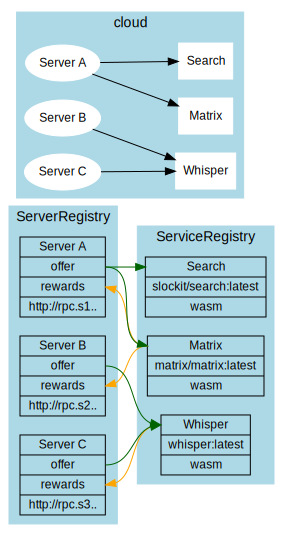

# Decentralizing central services

Many DAPPs still need some offchain-services, like search-services running on a server, which of course can be seen as single point of failure. In order to dectralize these even dapp-specific services they must fullfill these criteria:

1. **stateless** - since requests may be send to different servers they cannot hold a users state, which would only be available on one node.
2. **deterministic** - all servers need to produce the exact same result

If these requirements are met, the service can be registered defining the server behavior in a docker image.



# Incentivication

Each Server can define

- a list of services as offer
- a list of services to reward

The main idea is simply:

> **if you run my service I will run yours**

Each Server can specifiy which services we would like to see used. If another server offers them, he will also run at least as many rewareded services of the other node.

# Verification

Each Service specify a Verifier, which is a wasm-module (specified through a ipfs-hash). This wasm offers 2 function:

```js
function minRequests():number

function verify(request:RPCRequest[], responses:RPCResponse[])
```

A minimal version could simply asure running at least 2 requests and comparing them. In case they differ they can 

- check with the "home"-server
- convict nodes

## convicting

As a generic service convicting on chain can not be done, but each server is able to verify the result and if false downgrade the score.
