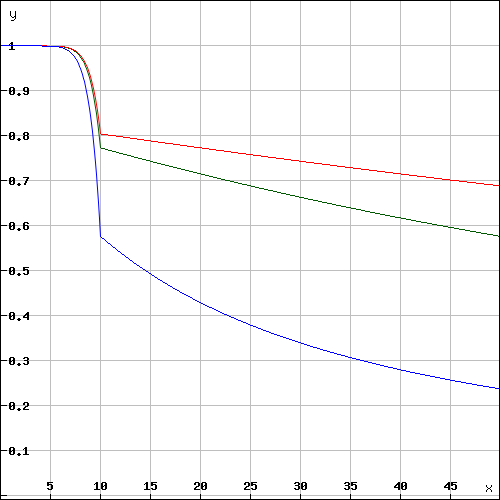
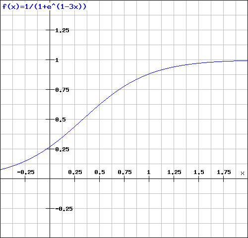

# Incentivization

*Important: This concept is still in development and discussion and not fully implemented yet.*

The original idea of blockchain is a permissionless peer-to-peer network, where anybody can participate if he only runs a node and sync with the other peers. Why this is still true, we know that such a node won't run on a small iot-device.

## Decentralizing Access

This is why a lot of users try remote-nodes to server their devices. But this introduces a new single-point of failure and the risk of man-in-the-middle attacks. 

So the first step is decentralizing remote nodes by sharing rpc-nodes with other apps. 

```eval_rst
.. graphviz::

  graph minimal_nonplanar_graphs {
    node [style=filled  fontname="Helvetica"]
  fontname="Helvetica"

  subgraph cluster_infura {
    label="centralized"  color=lightblue  style=filled
    node [color=white]

    i[label="infura"]
    __a[label="a"]
    __b[label="b"]
    __c[label="c"]

    i -- __a
    i -- __b
    i -- __c
  }

  subgraph cluster_1 {
      label="centralized per Dapp"  color=lightblue  style=filled
      node [color=white]
      _C[label="C"]
      _B[label="B"]
      _A[label="A"]
      _c[label="c"]
      _b[label="b"]
      _a[label="a"]

      _C -- _c
      _A -- _a
      _B -- _b
    }


    subgraph cluster_0 {
      label="Incubed"  color=lightblue  style=filled
      node [color=white]
      {A B C} -- {a b c}
    }
  }
```


## Verification

While this removes the single point of failure it introduces the risk of trust. We cannot simply trust other RPC-nodes. In order to turn this into a trustless Architecture, each Server needs to provide verifiable proofs. (for Details See [Ethereum Verification and MerkleProof](./Ethereum-Verification-and-MerkleProof) )

```eval_rst
.. graphviz::

  digraph minimal_nonplanar_graphs {
    node [style=filled  fontname="Helvetica"]
  fontname="Helvetica"
  edge[ fontname="Helvetica"]

  subgraph cluster_pow {
    label="Proof or Work"  color=lightblue  style=filled
    node [color=white]

    c[label="Client"]

    A[label="Node A"]
    B[label="Node B"]
    C[label="Node C"]

    c -> B[label=""]
    B -> c[label=" response\n + proof  \n + signed\n    header"]
    B -> A[label=" sign"]
    B -> C

  
  }

  subgraph cluster_poa {
    label="Proof of Authority"  color=lightblue  style=filled
    node [color=white]

    _c[label="Client"]

    _B[label="Node"]

    _c -> _B[label=""]
    _B -> _c[label=" response\n + proof  \n + header"]
  }

  subgraph cluster_pos {
    label="Proof of Stake"  color=lightblue  style=filled
    node [color=white]
  rank=same x N V
      
    x[label="Client"]

    N[label="Node"]
    V[label="Node (Validator)"]

    x -> N[label=""]
    N -> x[label=" response\n + proof  \n + header"]

    x -> V[label=" header"]

  
  }

  }


```

## Incentivization for nodes

In order to incentivize a node to serve requests to clients there must be something to gain (payment) or to lose ( access to other nodes for its clients ).

## Connecting Clients and Server

As a simple rule we can define: 

> **The incubed network will serve your client requests if you also run an honest node.**

This requires to connect a client key (used to sign his requests) with a registered server.
clients are able to share keys as long as the owner of the node is able to ensure their security. This makes it possible to use one key for the same mobile app or device.
The owner may also register as many keys as he wants for his server or even changes them from time to time. (as long as only one client key points to one server)
The key is registered in a client-contract, holding a mapping from the key to the server address.


```eval_rst
.. graphviz::

    digraph minimal_nonplanar_graphs {
    graph [ rankdir = "LR" ]
    fontname="Helvetica"
      subgraph all {
          label="Registry"

        subgraph cluster_cloud {
            label="cloud"  color=lightblue  style=filled
            node [ fontsize = "12",  color=white style=filled  fontname="Helvetica" ]

            A[label="Server A"]
            B[label="Server B"]
            C[label="Server C"]
      
        }

        subgraph cluster_registry {
            label="ServerRegistry"  color=lightblue  style=filled
            node [ fontsize = "12", shape = "record",  color=black style="" fontname="Helvetica" ]

            sa[label="<f0>Server A|cap:10|<f2>http://rpc.s1.."]
            sb[label="<f0>Server B|cap:100|<f2>http://rpc.s2.."]
            sc[label="<f0>Server C|cap:20|<f2>http://rpc.s3.."]

            sa:f2 -> A
            sb:f2 -> B
            sc:f2 -> C
      
        }


        subgraph cluster_client_registry {
            label="ClientRegistry"  color=lightblue  style=filled
            node [ fontsize = "12", style="", color=black fontname="Helvetica" ]

            ca[label="a"]
            cb[label="b"]
            cc[label="c"]
            cd[label="d"]
            ce[label="e"]

            ca:f0 -> sa:f0
            cb:f0 -> sb:f0
            cd:f0 -> sc:f0
            cc:f0 -> sc:f0
            ce:f0 -> sc:f0
      
        }


      }
    }

```


## Ensuring Client Access

Connecting a client key to a server does not mean he relies on it, but simply his requests will be served in the same quality as the connected node will serve other clients. 
This creates a very strong incentive to deliver all clients, because if a server node would be offline or refuses to deliver, eventually other nodes would also deliver less or even stop responding to requests coming from the connected clients.

To actually figure out which node delivers to clients, each server node will use one of the client keys to send Test-Requests and measure the Availability based on verified responses.

```eval_rst
.. graphviz::

    digraph minimal_nonplanar_graphs {
      node [style=filled  fontname="Helvetica"]
    fontname="Helvetica"

    ratio=0.8;

    subgraph cluster_1 {
        label="Verifying Nodes"  color=lightblue  style=filled
        node [color=white]
        ranksep=900000;
    //    rank=same
        A -> {B C D E }
        B -> {A C D E }
        C -> {A B D E }
        D -> {A B C E }
        E -> {A B C D  }
      }


    }

```


The servers will measure the `$ A_{availability}$` by checking periodically (like every hour, in order to make sure a malicious server will not respond to test requests only, these requests may be sent through an anonymous network like tor)

Based on the longtime ( >1 day ) and shorttime ( <1 day ) availibility the score is calculated:

```math
A = \frac{ R_{received} }{ R_{sent} }
```

In order to balance long time availability and short time issues, each node meassures both and calculates a factor for the score. This factor should ensure, that a short-time issues will not drop the score immediately,  but keep it up for a while and then drop. Also longtime availibility must be rewarded by dropping slower.

```math
A =  1 - ( 1 - \frac{A_{long} + 5 \cdot A_{short}}6 )^{10} 
```

- `$ A_{long}$` - the ratio between valid request received and sent within the last month
- `$ A_{short}$` - the ratio between valid request received and sent within the last 24h



Depending on the longtime availibility the a disconnected node will lose its score over time.


The final score is then calulated:

```math
score =  \frac{ A \cdot D_{weight} \cdot C_{max}}{weight}
```

- `$ A$` - the Availibility of the node.
- `$ weight$` - the weight of the incoming request from that servers clients (See LoadBalancing)
- `$ C_{max}$` - the maximal Number of open or parallel Requests the own server can handle ( will be taken from the registry )
- `$ D_{weight}$` - the weight of the Deposit of the node

This score is then used as the priority for incoming requests. this is done by keeping Track of the number of currently open or serving requests. Whenever a new Requests comes in, the node will do the following:

1. check the signature 
2. calculate the score based on the score of the node it is connected with.
3. accept or reject the request

```js
if ( score < openRequests ) reject()
```

This way nodes will reject requests with a lower score when the load is increasing. For a client, this means if I have a low score and the load in the network is high, my clients may get rejected often and so have to wait longer for responses. And if I have a score of 0, they even will be blacklisted.

## Deposit

Storing a high deposit brings more security to the network. This is important for proof-of-work-chains.
In order to reflect the benefit in the score the multiply it with the `$ D_{weight}$` ( the Deposit Weight )

```math
D_{weight} = \frac1{1 + e^{1-\frac{3 D}{D_{avg}}}}
```

- `$ D$` - the stored Deposit of the node
- `$ D_{avg}$` - the average Deposit of all nodes

A node without any deposit will so get only 26.8% of the max cap while any node with a average deposit gets 88% and above it quickly reaches 99%




## LoadBalancing

In an optimal network, each server would handle the same amount as the servers and all clients would have an equal share. In order to prevent situations where 80% of the requests come from clients belonging to the same node while the node is only delivering 10% of requests in the network, we need to decrease the score for clients sending more requests than their shares.
So for each node the weight can be calculated by:

```math
weight_n =  \frac{{\displaystyle\sum_{i=0}^n} C_i \cdot R_n } { {\displaystyle\sum_{i=0}^n} R_i \cdot C_n  } 
```
- `$ R_n$` - number of request serverd to one of the clients connected to the node
- `$ {\displaystyle\sum_{i=0}^n} R_i$` - total number of request serverd 
- `$ {\displaystyle\sum_{i=0}^n} C_i$` - total number of capacities of the registered servers
- `$ C_n$` - Capacity of the registered node 

Each node will update the `$ score$` and the `$weight$` for the other nodes after each check and this way prioritize incoming requests.

The Capacity of a node is the maximal number of parallel request it can handle and is stored in the ServerRegistry. This way all client know the cap and will weight the nodes accordingly which leads to more load to stronger servers. A node declaring a high capacity will gain a higher score and so its clients will get more reliable responses, but on the other hand, if you can not deliver the load you may lose your availability and so you score.

## Free Access

Each node may allow free access for clients without any signature. A special option `--freeScore=2` is used when starting the server. For any client requests without a signature, this `$score$` is used. Setting this value to 0 would not allow any free clients.

```
  if (!signature) score = conf.freeScore
```

A low value for freeScore would server requests only if the current load or the open requests are less then this number, which would mean, that getting a response from the network without signing may take very long because this client would send a lot of requests until he is lucky enough to get a response if the load is high. The chances are a lot better if the load is very low.

## Convict

Even though servers are allowed to register without a deposit, convicting is still a hard punishment. Because in this case the server is not part of the registry anymore and all his connected clients would be treated as without signature. In this case, his devices or app will probably stop working or be extremely slow. (depending on the freeScore configured in the all the nodes)

## Handling conflicts

In case of a conflict, each client has now at least one server he knows he can trust since it is run by the same owner. This makes it impossible for attackers to use Blacklist-Attacks or other threats which can be solved by requiring a response from the "home"-node.

