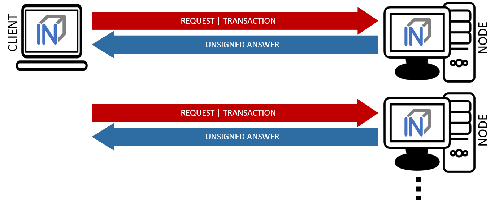
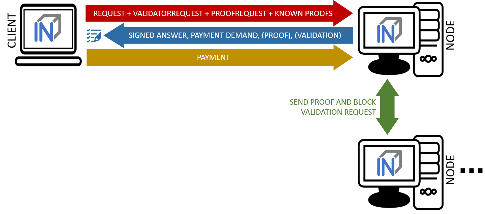
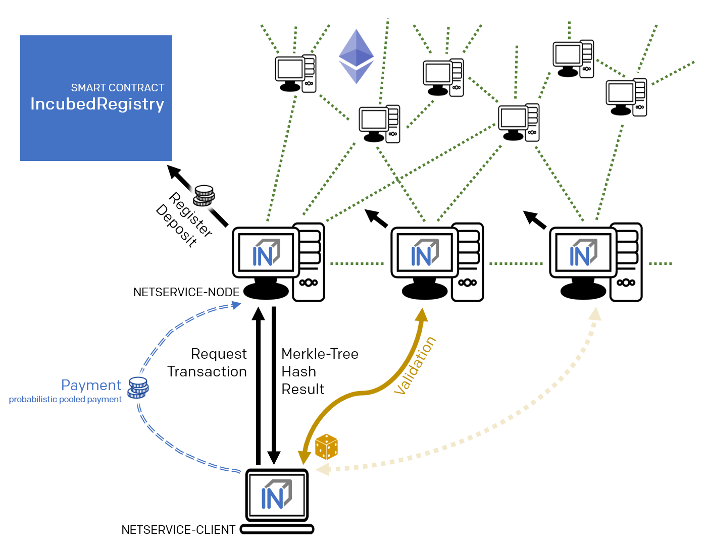

# Concept

To enable smart devices of the internet of things to be connected to the Ethereum blockchain, an Ethereum client needs to run on this hardware.
The same applies to other blockchains, whether based on Ethereum or not.
While current notebooks or desktop computers with a broadband Internet connection are able to run a full node without any problems, smaller devices such as
tablets and smartphones with less powerful hardware or more restricted Internet connection are capable of running a light node. However, many IoT
devices are severely limited in terms of computing capacity, connectivity and often also power supply. Connecting an IoT device to a remote node
enables even low-performance devices to be connected to blockchain. By using distinct remote nodes, the advantages of a decentralized network are underminded without being
forced to trust single players or there is a risk of malfunction or attack because there is a single point of failure.

With the presented Trustless Incentivized Remote Node Network, in short INCUBED, it will be possible to establish a decentralized and secure network of remote nodes, which enables trustworthy and fast access to blockchain for a large number of low-performance IoT devices.

### Situation

The number of IoT devices is increasing rapidly. This opens up many new possibilities for equipping these devices with payment or sharing functionality.
 While desktop computers can run an Ethereum full client without any problems,
 small devices are limited in terms of computing power, available memory,
 Internet connectivity and bandwidth.
 The development of Ethereum light clients has significantly contributed
 to the connection of smaller devices with the blockchain.
 Devices like smartphones or computers like Raspberry PI or Samsung Artik
 5/7/10 are able to run light clients.
 However, the requirements regarding the mentioned resources and the available
 power supply are not met by a large number of IoT devices.

 One option is to run the client on an external server, which is then used by the device as a remote client. However, central advantages of the blockchain technology - decentralization rather than having to trust individual players - are lost this way. There is also a risk that the service will fail due to the failure of individual nodes.

A possible solution for this may be a decentralized network of remote-nodes (netservice nodes) combined with a protocol to secure access.


### Low-Performance Hardware

There are several classes of IoT devices, for which running a full or light client is somehow problematic and a INNN can be a real benefit or even a job enabler:

- **Devices with insufficient calculation power or memory space**

    Today, the majority of IoT devices have compute units not capable of running a full client or a light client. To run such a client, the computer needs to be able to synchronize the blockchain and calculate the state (or at least the needed part thereof).

- **Devices with insufficient power supply**

    If devices are mobile (for instance a bike lock or an environment sensor) and rely on a battery for power supply, running a full or a light light, which needs to be constantly synchronized, is not possible. 

- **Devices which are not permanently connected to the Internet**

    Devices which are not permantently connected to the Internet, also have trouble running a full or a light client as these clients need to be in sync before they can be used. 

### Scalability

One of the most important topics discussed regarding blockchain technology is scalability. Of course, a working INCUBED does not solve the scaling problems that more transactions can be executed per second. However, it does contribute to providing access to the Ethereum network for devices that could not be integrated into existing clients (full client, light client) due to their lack of performance or availability of a continuous Internet connection with sufficient bandwidth.


## Use Cases

With the following use cases, some realistic scenarios should be designed in which the use of INCUBED will be at least useful. These use cases are intended as real-life relevant examples only to envision the potential of this technology but are by no means a somehow complete list of possible applications. 

### Publicly Accessible Environment Sensor

#### Description

An environment sensor, which measures some air quality characteristics, is installed in the city of Stuttgart. All measuring data is stored locally and can be accessed via the Internet by paying a small fee. Also a hash of the current data set is published to the public Ethereum blockchain to validate the integrity of the data. 

The computational power of the control unit is restricted to collecting the measuring data from the sensors and storing these data to the local storage. It is able to encrypt or cryptographically sign messages. As this sensor is one of thousands throughout Europe, the energy consumption must be as low as possible. A special low-performance hardware is installed. An Internet connection is provided, but the available bandwidth is not sufficient to synchrone a blockchain client. 

#### Blockchain Integration

The connection to the blockchain is only needed if someone requests the data and sends the validation hash code to the smart contract.

The installed hardware (available computational power) and the requirement to minimize energy consumption disable the installation and operation of a light client without installing addition hardware (like a Samsung Artik 7) as PBCD (Physical Blockchain Connection Device/Ethereum computer). Also, the available Internet bandwidth would need to be enhanced to be able to synchronize properly with the blockchain.

Using a netservice-client connected to the INCUBED can be realized using the existing hardware and Internet connection. No additional hardware or Internet bandwidth is needed. The netservice-client connects to the INCUBED only to send signed messages, to trigger transactions or to request information from the blockchain. 

### Smart Bike Lock

#### Description

An smart bike lock which enables sharing is installed on an e-bike. It is able to connect to the Internet to check if renting is allowed and the current user is authorized to open the lock.

The computational power of the control unit is restricted to the control of the lock. Because the energy is provided by the e-bike's battery, the controller runs only when needed in order to save energy. For this reason, it is also not possible to maintain a permanent Internet connection. 

#### Blockchain Integration

Running a light-client on such a platform would consume far too much energy, but even synchronizing the client only when needed would take too much time and require an Internet connection with the corresponding bandwidth, which is not always the case. With a netservice-client running on the lock, a secure connection to the blockchain can be established at the required times, even if the Internet connection only allows limited bandwidth. In times when there is no rental process in action, neither computing power is needed nor data is transferred.

### Smart Home - Smart Thermostat

#### Description

With smart home devices it is possible to realize new business models, e. g. for the energy supply. With smart thermostats it is possible to bill heating energy pay-per-use. During operation, the thermostat must only be connected to the blockchain if there is a heating requirement and a demand exists. Then the thermostat must check whether the user is authorized and then also perform the transactions for payment.

#### Blockchain Integration

Similar to the cycle lock application, a thermostat does not need to be permanently connected to the blockchain to keep a client in sync. Furthermore, its hardware is not able to run a full or light client. Here, too, it makes sense to use a netservice-client. Such a client can be developed especially for this hardware. 

###  Smartphone App

####  Description

The range of smartphone apps that can or should be connected to the blockchain is widely diversified. These can be any apps with payment functions, apps that use blockchain as a notary service, apps that control or lend IoT devices, apps that visualize data from the blockchain, and much more.

Often these apps only need sporadic access to the blockchain. Due to the limited battery power and limited data volume, neither a full client nor a light client is really suitable for such applications, as these clients require a permanent connection to keep the blockchain up-to-date.

#### Blockchain Integration

In order to minimize energy consumption and the amount of data to be transferred, it makes sense to implement smartphone applications that do not necessarily require a permanent connection to the Internet and thus also to the blockchain with a netservice-client. This makes it possible to dispense with a centralized remote server solution, but only have access to the blockchain when it is needed without having to wait long before the client is synchronized.


### Advantages

As has already been pointed out in the use cases, there are various advantages that speak in favor of using INCUBED: 

- Devices with low computing power can communicate with the blockchain. 

- Devices with a poor Internet connection or limited bandwidth can communicate with the blockchain. 

- Devices with a limited power supply can be integrated. 

- It is a decentralized solution that does not require a central service provider for remote nodes. 

- A remote node does not need to be trusted, as there is a verification facility. 

- Existing centralized remote services can be easily integrated.

- Net service clients for special and proprietary hardware can be implemented independently of current Ethereum developments.

### Challenges

Of course, there are several challenges that need to be solved in order to implement a working INCUBED.

#### Security

The biggest challenge for a decentralized and trust-free system is to ensure that one can make sure that the information supplied is actually correct. If a full client runs on a device and is synchronized with the network, it can check the correctness itself. A light client can also check if the block headers match, but does not have the transactions available and requires a connection to a full client for this information. A remote client that communicates with a full client via the REST API has no direct way to verify that the answer is correct. In a decentralized network of netservice-nodes whose trustworthiness is not known, a way to be certain with a high probability that the answer is correct is required. The INCUBED system provides the nodes that supply the information with additional nodes that serve as validators. 

####  Business models

In order to provide an incentive to provide nodes for a decentralized solution, any transaction or query that passes through such a node would have to be remunerated with an additional fee for the operator of the node. However, this would further increase the transaction costs, which are already a real problem for micro-payments. However, there are also numerous non-monetary incentives that encourage participation in this infrastructure.


## Architecture

### Overview

An INCUBED network consists of several components:

1. The INCUBED registry (later called registry). This is a Smart Contract deployed on the Ethereum Main-Net where all nodes that want to participate in the network must register and, if desired, store a security deposit.

2. The INCUBED or Netservice node (later called node), which are also full nodes for the blockchain. The nodes act as information providers and validators.

3. The INCUBED or Netservice clients (later called client), which are installed e.g. in the IoT devices.

4. Watchdogs who as autonomous authorities (bots) ensure that misbehavior of nodes is uncovered and punished.

#### Initialization of a Client

Each client gets an initial list of boot nodes by default. Before its first "real" communication with the network, the current list of nodes must be queried as they are registered in the registry (see section [subsec:IN3-Registry-Smart-Contract]). Initially, this can only be done using an invalidated query (see figure [fig:unvalidated request]). In order to have the maximum possible security, this query can and should be made to several or even all boot nodes in order to obtain a valid list with great certainty.

This list must be updated at regular intervals to ensure that the current network is always available.

#### Unvalidated Requests / Transactions

Unvalidated queries and transactions are performed by the client by selecting one or more nodes from the registry and sending them the request (see figure [fig:unvalidated request]). Although the responses cannot be verified directly, the option to send the request to multiple nodes in parallel remains. The returned results can then be checked for consistency by the client. Assuming that the majority will deliver the correct result (or execute the transaction correctly), this will at least increase the likelihood of receiving the correct response (Proof of Majority).


There are other requests too that can only be returned as an unverified response. This could be the case, for example: 

- Current block number (the node may not have synchronized the latest block yet or may be in a micro fork,...) 

- Information from a block that has not yet been finalized 

- Gas price

The multiple parallel query of several nodes and the verification of the results according to the majority principle is a standard functionality of the client. With the number of nodes requested in parallel, a suitable compromise must be made between increased data traffic, effort for processing the data (comparison) and higher security.

The selection of the nodes to be queried must be made at random. In particular, successive queries should always be sent to different nodes. This way it is not possible, or at least only very difficult, for a possibly misbehaving node to send specific incorrect answers to a certain client, since it cannot be foreseen at any time that the same client will also send a follow-up query to the same node, for example, and thus the danger is high that the misbehavior will be uncovered. 

In the case of a misbehavior, the client can blacklist this node or at least reduce the internal rating of this node. However, inconsistent responses can also be provided unintentionally by a node, i.e. without the intention of spreading false information. This can happen, for example, if the node has not yet synchronized the current block or is running on a micro fork. These possibilities must therefore always be taken into consideration when the client "reacts" to such a response.

An unvalidated answer will be returned unsigned. Thus, it is not possible to punish the sender in case of an incorrect response, except that the client can blacklist or downgrade the sender in the above-mentioned form.

##### Validated Requests

The second form of queries are validated requests. The nodes must be able to provide various verification options and proofs in addition to the result of the request. With validated requests, it is possible to achieve a similar level of security with an INCUBED client as with a light or even full client, without having to blindly trust a centralized middleman (as is the case with a remote client). Depending on the security requirements and the available resources (e.g. computing power), different validations and proofs are possible.



As with an invalidated query, the node to be queried should be selected randomly. However, there are various criteria, such as the deposited security deposit, reliability and performance from previous requests, etc., which can or must also be included in the selection.

**Call Parameter**

A validated request consists of the parts:

- Actual request
- List of validators

- Proof request 

- List of already known validations and proofs (optional).

**Return values**

The return depends on the request:

- The requested information (signed by the node)

- The signed answers of the validators (block hash) - 1 or more

- The Merkle Proof 

- Request for a payment.

**Validation**

Validation refers to the checking of a block hash by one or more additional nodes. A client cannot perform this check on its own. To check the credibility of a node (information provider), the block hash it returns is checked by one or more independent nodes (validators). If a validator node can detect the malfunction of the originally requested node (delivery of an incorrect block), it can receive its security deposit and the compromised node is removed from the registry. The same applies to a validator node.

Since the network connection and bandwidth of a node is often better than that of a client, and the number of client requests should be as small as possible, the validation requests are sent from the requested node (information provider) to the validators. These return the signed answer, so that there is no possibility for the information provider to manipulate the answer. Since the selection of nodes to act as validators is made only by the client, a potentially malfunctioning node cannot influence it or select a validator to participate in a conspiracy with it.

If the selected validator is not available or does not respond, the client can specify several validators in the request, which are then contacted instead of the failed node. For example, if multiple nodes are involved in a conspiracy, the requested misbehaving node could only send the validation requests to the nodes that support the wrong response.

**Proof**

The validators only confirm that the block hash of the block from which the requested information originates is correct. The consistency of the returned response cannot be checked in this way.

Optionally, this information can be checked directly by the client. However, this is obligatory, but considerably increases safety. On the other hand, more information has to be transferred and a computationally complex check has to be performed by the client.

When a proof is requested, the node provides the Merkle Tree of the response so that the client can calculate and check the Merkle Root for the result itself.

**Payment and Incentives**

As an incentive system for the return of verified responses, the node can request a payment. For this, however, the node must guarantee with its security deposit that the answer is correct.

There are two strong incentives for the node to provide the correct response with high performance since it loses its deposit when a validator (wrong block hash) detects misbehavior and is eliminated from the registry, and receives a reward for this if it provides a correct response.

If a client refuses payment after receiving the correctly validated information which it requested, it can be blacklisted or downgraded by the node so that it will no longer receive responses to its requests.

If a node refuses to provide the information for no reason, it is blacklisted by the client in return or is at least downgraded in rating, which means that it may no longer receive any requests and therefore no remuneration in the future.

If the client detects that the Merkle Proof is not correct (although the validated block hash is correct), it cannot attack the node's deposit but has the option to blacklist or downgrade the node to no longer ask it. A node caught this way of misbehavior does not receive any more requests and therefore cannot make any profits.

The security deposit of the node has a decisive influence on how much trust is placed in it. When selecting the node, a client chooses those nodes that have a corresponding deposit (stake), depending on the security requirements (e.g. high value of a transaction). Conversely, nodes with a high deposit will also charge higher fees, so that a market with supply and demand for different security requirements will develop.




### IN3-Registry Smart Contract

Each client is able to fetch the complete list including the deposit and other information from the contract, which is required in order to operate. The client must update the list of nodes logged into the registry during initialization and regularly during operation to notice changes (e.g. if a node is removed from the registry intentionally or due to misbehavior detected).

In order to maintain a list of network nodes offering INCUBED-services a smart contract IN3Registry in the Ethereum Main-Net is deployed. This contract is used to manage ownership and deposit for each node.


```js
contract ServerRegistry {

    /// server has been registered or updated its registry props or deposit
    event LogServerRegistered(string url, uint props, address owner, uint deposit);

    ///  a caller requested to unregister a server.
    event LogServerUnregisterRequested(string url, address owner, address caller);

    /// the owner canceled the unregister-proccess
    event LogServerUnregisterCanceled(string url, address owner);

    /// a Server was convicted
    event LogServerConvicted(string url, address owner);

    /// a Server is removed
    event LogServerRemoved(string url, address owner);

    struct In3Server {
        string url;  // the url of the server
        address owner; // the owner, which is also the key to sign blockhashes
        uint deposit; // stored deposit
        uint props; // a list of properties-flags representing the capabilities of the server

        // unregister state
        uint128 unregisterTime; // earliest timestamp in to to call unregister
        uint128 unregisterDeposit; // Deposit for unregistering
        address unregisterCaller; // address of the caller requesting the unregister
    }

    /// server list of incubed nodes    
    In3Server[] public servers;
    
    /// length of the serverlist
    function totalServers() public view returns (uint) ;

    /// register a new Server with the sender as owner    
    function registerServer(string _url, uint _props) public payable;

    /// updates a Server by adding the msg.value to the deposit and setting the props    
    function updateServer(uint _serverIndex, uint _props) public payable;

    /// this should be called before unregistering a server.
    /// there are 2 use cases:
    /// a) the owner wants to stop offering the service and remove the server.
    ///    in this case he has to wait for one hour before actually removing the server. 
    ///    This is needed in order to give others a chance to convict it in case this server signs wrong hashes
    /// b) anybody can request to remove a server because it has been inactive.
    ///    in this case he needs to pay a small deposit, which he will lose 
    //       if the owner become active again 
    //       or the caller will receive 20% of the deposit in case the owner does not react.
    function requestUnregisteringServer(uint _serverIndex) payable public;
    
    /// this function must be called by the caller of the requestUnregisteringServer-function after 28 days
    /// if the owner did not cancel, the caller will receive 20% of the server deposit + his own deposit.
    /// the owner will receive 80% of the server deposit before the server will be removed.
    function confirmUnregisteringServer(uint _serverIndex) public ;

    /// this function must be called by the owner to cancel the unregister-process.
    /// if the caller is not the owner, then he will also get the deposit paid by the caller.
    function cancelUnregisteringServer(uint _serverIndex) public;


    /// convicts a server that signed a wrong blockhash
    function convict(uint _serverIndex, bytes32 _blockhash, uint _blocknumber, uint8 _v, bytes32 _r, bytes32 _s) public ;

}
```

To register, the owner of the node needs to provide the following data:

- **props** : a bitmask holding properties like.

- **url** : the public url of the server.

- **msg.value** : the value sent during this transaction is stored as deposit in the contract.

- **msg.sender** : the sender of the transaction is set as owner of the node and therefore able to manage it at any given time.

#### Deposit

The deposit is an important incentive for the secure operation of the INCUBED network. The risk of losing the deposit if misconduct is detected motivates the nodes to provide correct and verifiable answers.

The amount of the deposit can be part of the decision criterion for the clients when selecting the node for a request. The "value" of the request can therefore influence the selection of the node (as information provider). For example, a request that is associated with a high value may not be sent to a node that has a very low deposit. On the other hand, for a request for a dashboard, which only provides an overview of some information, the size of the deposit may play a subordinate role.

### Netservice-Node

The net service node (short: node) is the communication interface for the client to the blockchain client. It can be implemented as a separate application or as an integrated module of a blockchain client (such as Geth or Parity).

Nodes must provide two different services: 

- Information Provider

- Validator.

#### Information Provider

A client directly addresses a node (information provider) to retrieve the desired information. Similar to a remote client, the node interacts with the blockchain via its blockchain client and returns the information to the requesting client. Furthermore, the node (information provider) provides the information the client needs to verify the result of the query (validation and proof). For the service, it can request payment when it returns a validated response.



If an information provider is found to return incorrect information as a validated response, it loses its deposit and is removed from the registry. It can be transferred by a validator or watchdog.

#### Validator

The second service that a node has to provide is validation. When a client submits a validated request to the information provider, it also specifies the node(s) that are designated as validators. Each node that is logged on to the registry must also accept the task as validator. 

If a validator is found to return false information as validation, it loses its deposit and is removed from the registry. It can be transferred by another validator or a watchdog.

#### Watchdog

Watchdogs are independent bots whose random validators logged in to the registry are checked by specific queries to detect misbehavior. In order to provide an incentive for validator activity, watchdogs can also deliberately pretend misbehavior and thus give the validator the opportunity to claim the security deposit.

### Netservice-Client

The netservice client (short client) is the instance running on the device that needs the connection to the blockchain. It communicates with the nodes of the INCUBED network via a REST API. 

The client can decide autonomously whether it wants to request an unvalidated or a validated answer (see section...). In addition to communicating with the nodes, the client has the ability to verify the responses by evaluating the majority (unvalidated request) or validations and proofs (validated requests).

The client receives the list of available nodes of the INCUBED network from the registry and ensures that this list is always kept up-to-date. Based on the list, the client also manages a local reputation system of nodes to take into account performance, reliability, trustworthiness and security when selecting a node.

A client can communicate with different blockchains at the same time. In the registry, nodes of different blockchains (identified by their ID) are registered so that the client can and must filter the list to identify the nodes that can process (and validate, if necessary) its request. 

#### Local Reputation System

The local reputations system aims to support the selection of a node. 

The reputation system is also the only way for a client to blacklist nodes that are unreliable or classified as fraudulent. This can happen, for example, in the case of an unvalidated query if the results of a node do not match those of the majority, or in the case of validated queries, if the validation is correct but the proof is incorrect.

#### Performance-Weighting 

In order to balance the network, each client may weight each node by:

`$ weight=\frac{\max(\lg(deposit),1)}{\max(avgResponseTime,100)} $`

Based on the weight of each node a random node is chosen for each request. While the deposit is read by the contract, the avgResponseTime is managed by the client himself. The does so by measuring the time between request and response and calculate the average (in ms) within the last 24 hours. This way the load is balanced and faster servers will get more traffic.

### Payment / Incentives

To build an incentive-based network, it is necessary to have appropriate technologies to process payments. The payments to be made in INCUBED (e.g. as a fee for a validated answer) are, without exception micro payments (other than the deposit of the deposit, which is part of the registration of a node and which is not mentioned here, however). When designing a suitable payment solution, it must therefore be ensured that a reasonable balance is always found between the actual fee, transaction costs and transaction times.

#### Direct Transaction Payment 

Direct payment by transaction is of course possible, but this is not possible due to the high transaction costs. Exceptions to this could be transactions with a high value, so that corresponding transaction costs would be acceptable.

However, such payments are not practical for general use.

#### State Channels

State channels are well-suited for the processing of micropayments. A decisive point of the protocol is that the node must always be selected randomly (albeit weighted according to further criteria). However, it is not practical for a client to open a separate state channel (including deposit) with each potential node that it wants to use for a request. To establish a suitable micropayment system based on state channels, a state channel network such as Raiden is required. If enough partners are interconnected in such a network and a path can be found between two partners, payments can also be exchanged between these participants.

#### Probabilistic Payment

Another way of making small payments is probabilistic micropayments. The idea is based on issuing probabilistic lottery tickets instead of very small direct payments, which, with a certain probability, promise to pay out a higher amount. The probability distribution is adjusted so that the expected value corresponds to the payment to be made.

For a probabilistic payment, an amount corresponding to the value of the lottery ticket is deposited. Instead of direct payment, tickets are now issued that have a high likelihood of winning. If a ticket is not a winning ticket, it expires and does not entitle the recipient to receive a payment. Winning tickets, on the other hand, entitle the recipient to receive the full value of the ticket.

Since this value is so high that a transaction is worthwhile, the ticket can be redeemed in exchange for a payment.

Probabilistic payments are particularly suitable for combining a continuous, preferably evenly distributed flow of small payments into individual larger payments (e.g. for streaming data).

Similar to state channels, a type of payment channel is created between two partners (with an appropriate deposit).

For the application in the INCUBED protocol, it is not practical to establish individual probabilistic payment channels between each client and requested node, since on the one hand the prerequisite of a continuous and evenly distributed payment stream is not given and, on the other hand, payments may be very irregularly required (e.g. if a client only rarely sends queries).

The analog to a state channel network is pooled probabilistic payments. Payers can be pooled and recipients can also be connected in a pool, or both.


## Scaling

The interface between client and node is independent of the blockchain with which the node communicates. This allows a client to communicate with multiple blockchains / networks simultaneously as long as suitable nodes are registered in the registry. 

For example, a payment transaction can take place on the Ethereum Mainnet and access authorization can be triggered in a special application chain.

### Multi Chain Support

Each node may support one or more network or chains. The supported list can be read by filtering the list of all servers in the contract. 

The ChainId refers to a list based on EIP-155. The ChainIds defined there will be extended by enabling even custom chains to register a new chainId.

### Conclusion

INCUBED establishes a decentralized network of validatable remote nodes, which enables IoT devices in particular to gain secure and reliable access to the blockchain. The demands on the client's computing and storage capacity can be reduced to a minimum, as can the requirements on connectivity and network traffic.

INCUBED also provides a platform for scaling by allowing multiple blockchains to be accessed in parallel from the same client. Although INCUBED is designed in the first instance for the Ethereum network (and other chains using the Ethereum protocol), in principle other networks and blockchains can also be integrated, as long as it is possible to realize a node that can work as information provider (incl. proof) and validator.
