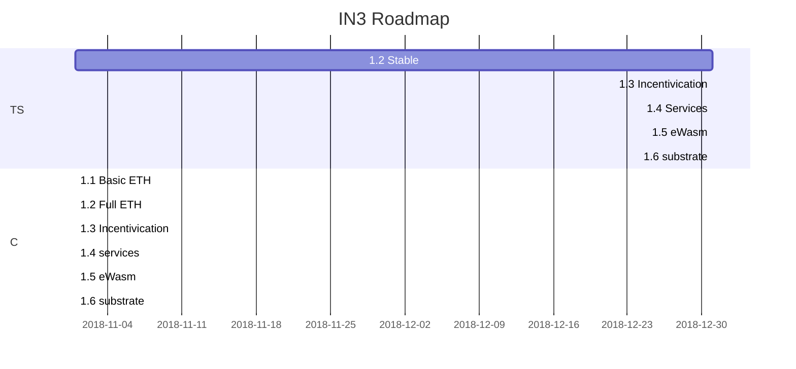

## Milestones

```mermaid

gantt
    title IN3 Roadmap

    section TS
    1.2 Stable          : r12, 2018-11-01,60d
    1.3 Incentivication : r13, after r12 ,2019-03-31
    1.4 Services        : r14, after r13 ,2019-05-31
    1.5 eWasm           : r15, after r14 ,2019-11-01
    1.6 substrate       : r16, after r15 ,2020-02-01

    section C
    1.1 Basic ETH       : c1, 2018-11-01, 2019-01-31
    1.2 Full ETH        : c2, after c1 ,2019-03-31
    1.3 Incentivication : c3, after c2 ,2019-05-31
    1.4 services        : c4, after c3 ,2019-09-30
    1.5 eWasm           : c5, after c4 ,2019-12-31
    1.6 substrate       : c6, after c5 ,2020-02-27

 
```